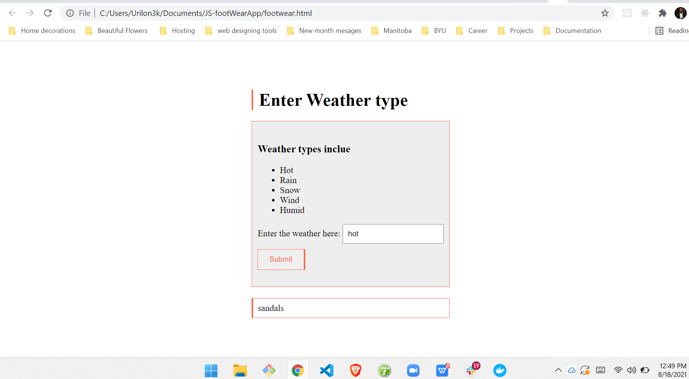

# JS-footWearApp
<p>
Simple JavaScript program that helps a user choose the correct footwear for the day's weather <br>

| Weather | Footwear |
| ------------- | ------------- |
| Hot  | sandals  |
| Rain  | galoshes |
| Snow  | boots  |
| Humid / wind  | shoes |
</p>

## Defining Table

<br>

```javascript
// Input(s): Recieve weather info
// Processing: Compute which shoe is best for the weather given
// Output(s): Display the best wear type for the given weather

// Heres the JS code. be sure to reference index HTML for the class and Id declarations

function wearType() {
    let answer = document.getElementById("weather").value
    let footwear = document.getElementById("footwear")
    if (answer.toLowerCase() == "hot") {
        footwear.innerHTML = "sandals"
    } else if (answer.toLowerCase() == "rain") {
        footwear.innerHTML = "galoshes"
    } else if (answer.toLowerCase() == "snow") {
        footwear.innerHTML = "boots"
    } else if (answer.toLowerCase() == "humid" || answer.toLowerCase() == "wind") {
        footwear.innerHTML = "shoes"
    } else {
        footwear.innerHTML = "Please enter a corect weather type"
    }

}
```


## Screenshots

<br>




  

  
## Extras

Feel free to email me anytime with your questions, link in profile page, if you need help understanding the code. 

You may copy or use the code as it pleases you.

Enjoy

&copy; Israel Damilola Akinwumi
  
